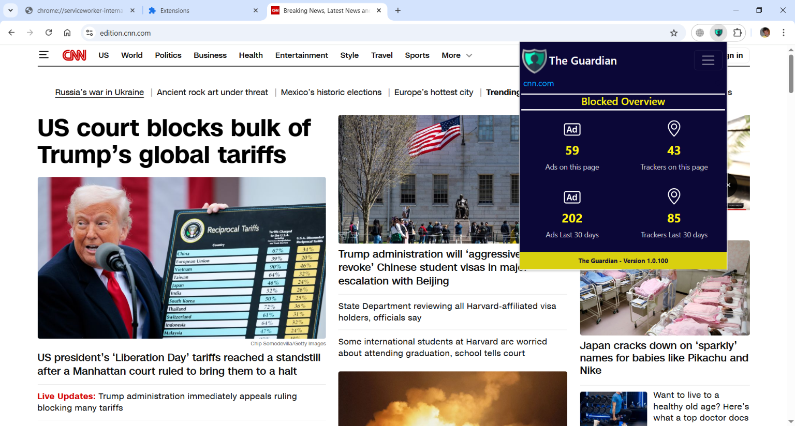
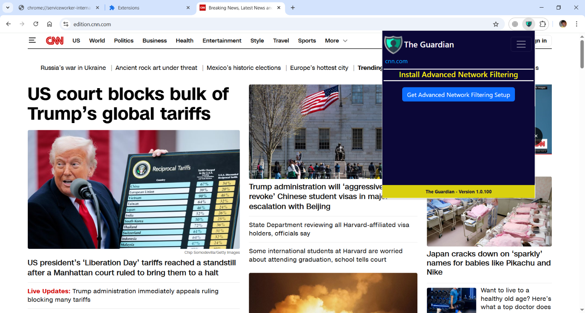

# The Guardian & Advanced Network Filtering (ANF)

**The Guardian** is a new, advanced Content Blocker extension for Chrome and Edge browsers. Versions for Firefox and Safari will also be available in the near future.

*The Guardian* can work standalone, with the features of a very powerful Content Blocker, or, by installing **Advanced Network Filtering** (**ANF**), with the ability to drive  network traffic filtering and control exactly which domains and IP addresses are to be blocked. 

*ANF* can block well known dangerous or unwanted domains (malware, phishing, annoying ads, intrusive trackers, fraud, adult, etc.) **at DNS level**, resulting in a faster and safer network surfing.

**But there's more**. By installing and enabling *ANF* using *The Guardian*, network filtering will be global to the device where *ANF* is installed and therefore extended to all installed applications, not just browsers.

To define which domains and IP addresses should be blocked, *ANF* uses a simple text file with a (big and daily mantained) list of domains to block.

*The Guardian* extension has the ability to control *ANF* by sending it one of the commands defined during the design phase.

Currently, *The Guardian* offers the ability to enable, disable, and request the status of *ANF* using a section of its *Popup*. In future versions of *The Guardian*, other commands will be added, such as the ability to add/remove personal domains in the *ANF*  blacklist.

*The Guardian* uses the **NativeMessaging** API to interface with *ANF*, interfacing with a custom **NativeMessagingHost** created ad hoc. The *NativeMessagingHost* sends commands to and receives responses from *ANF*.

#### ANF Structure

*ANF* is structurally composed of two Windows Services:

- **GuardianMITM**, which interfaces with *The Guardian* (or rather, with its *NativeMessagingHost*), 

- and **[DNSCrypt-Proxy](https://github.com/DNSCrypt/dnscrypt-proxy)** , which acts as a filter over the network and increases security. For more details on all the features of *DNSCrypt*, please refer to its excellent documentation.

*GuardianMITM*, the *Man-In-The-Middle*, is capable of distributing requests and responses between *The Guardian* and *DNSCrypt*, as well as managing the configuration and restoration of network interfaces when *DNSCrypt* is enabled or disabled in a completely transparent way. 

#### Start and Stop ANF

Currently, *ANF* can only be manipulated using *The Guardian*. The next version, while remaining fully compatible with *The Guardian*, will also have a graphical user interface, where the user will be able to perform various operations, such as defining which physical interface to apply *ANF* to (all active ones, only WiFi, only an Ethernet card, etc.), manipulating the blacklist in a real editor, etc., transforming *ANF* into a standalone too product.

#### How to Install

Until publication in the various Stores, *The Guardian* can be actually installed in Chrome or Edge as an **Unpacked extension**, with **Developers Mode enabled**. Once installed it is fully functional as a Content Blocker only. Note that *The Guardian* has a static key defined in its manifest, needed for the *NativeMessagingHost* manifest settings.

Until further notice, *Advanced Network Filtering (ANF)* can be installed by using the latest Setup released in this repository. Once installed, it can be enabled/disabled by using *The Guardian* popup. 
